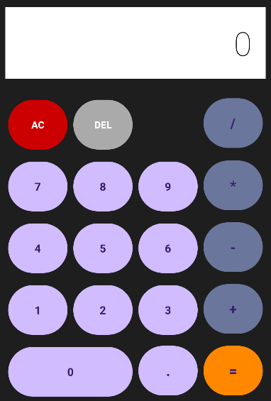
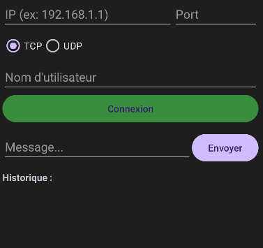
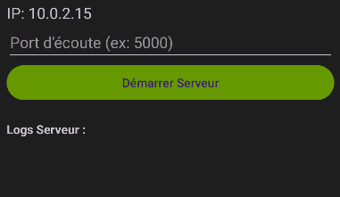
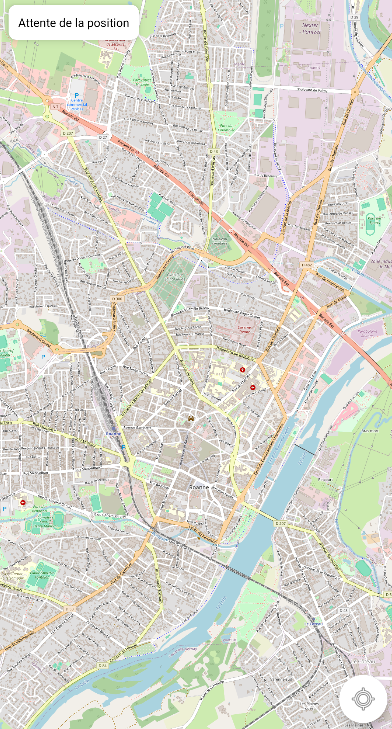
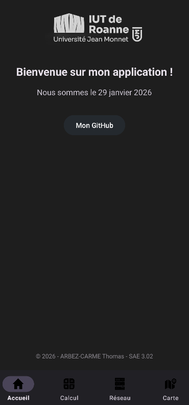
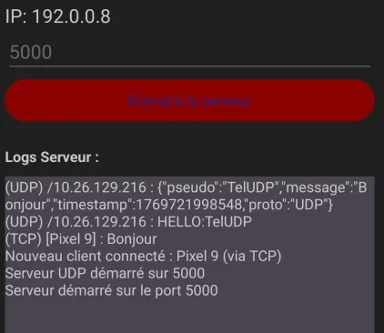
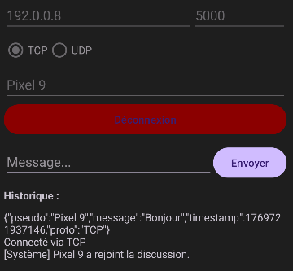
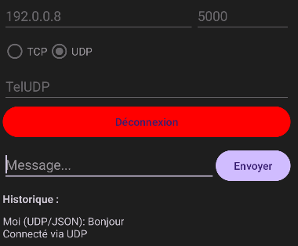

## Introduction

Ce projet consiste à développer une application Android capable de gérer des connexions client/serveur en utilisant les protocoles TCP/IP et UDP. L'application doit également permettre d'envoyer et de recevoir des structures de données complexes. Ce compte rendu décrit les différentes étapes de développement, les choix techniques, et les résultats finaux.

## Description de l'Application

### Page d'Accueil

La page d'accueil de l'application inclut un logo, la date actuelle, un bouton lien vers le dépôt GitHub du projet, et quatre boutons de navigation pour basculer entre les différentes vues : Accueil, Calcul, Réseau, et Carte.  

### Vue Calculatrice

La vue Calculatrice permet de réaliser des opérations mathématiques de base (addition, soustraction, multiplication, division) et inclut des boutons pour supprimer un caractère ou tout le calcul, ainsi qu'un bouton pour les calculs décimaux.  

### Vue Réseau

La vue Réseau permet de configurer et de gérer des connexions client/serveur en renseignant l'IP, le port, le protocole (TCP/UDP), et l'utilisateur. Elle permet d'envoyer des messages et de visualiser l'historique des communications.
Mode Client :  
  
Mode Serveur :  
  

### Vue Carte

La vue Carte est liée à un autre projet (SAE3.01) et permet d'afficher des données GPS sur une carte OpenStreetMap via le protocole MQTT.  

### Support des Modes Clair et Sombre

L'application supporte les modes clair et sombre pour une meilleure expérience utilisateur.
Mode Clair :  
  
Mode Sombre :   
  

## Implémentation Technique

### Protocoles Utilisés

L'application utilise les protocoles TCP/IP et UDP pour la communication entre clients et serveur. Le choix du protocole peut être configuré par l'utilisateur dans la vue Réseau.

### Gestion des Connexions

Le serveur est capable de gérer plusieurs clients en parallèle grâce à l'utilisation du multithreading. Chaque client est géré par un thread séparé, permettant une communication simultanée et efficace.

### Structure des Données

L'application est capable d'envoyer et de recevoir des structures de données complexes, y compris des données sérialisées.

## Développement et Codes

### Fichiers Java

- **MainActivity.java** : Configure la barre de navigation en bas de l'écran et gère la navigation entre les différentes vues.
- **HomeFragment.java** : Gère la logique de la page d'accueil, comme l'affichage de la date et la gestion des interactions avec les éléments de la page.
- **CalculFragment.java** : Gère la logique de la calculatrice, comme les opérations mathématiques et la gestion des entrées utilisateur.
- **NetworkFragment.java** : Gère la logique des connexions client/serveur, comme la configuration des connexions et l'affichage de l'historique des communications.
- **MapFragment.java** : Gère la logique de l'affichage des données GPS sur une carte OpenStreetMap.

### Fichiers XML

- **activity_main.xml** : Définit la mise en page de l'activité principale avec une barre de navigation et une zone libre pour afficher les différentes vues.
- **fragment_home.xml** : Définit la mise en page de la page d'accueil avec le logo, la date, le bouton lien vers GitHub, et les autres éléments.
- **fragment_calcul.xml** : Définit la mise en page de la calculatrice avec les boutons pour les opérations mathématiques et les fonctions de suppression.
- **fragment_network.xml** : Définit la mise en page de la vue Réseau avec les champs pour configurer les connexions et afficher l'historique des communications.
- **fragment_map.xml** : Définit la mise en page de la vue Carte avec la carte OpenStreetMap et les éléments pour afficher les données GPS.

### Interaction entre les Fichiers

Les fichiers Java interagissent avec les fichiers XML pour afficher et gérer les différentes vues. Par exemple, `MainActivity.java` utilise `activity_main.xml` pour configurer la barre de navigation et gérer la navigation entre les différentes vues.

## Tests et Résultats

Test de connexion du Client/Serveur avec le Serveur sur un Téléphone physique et deux Clients sur les Téléphones émuler de Android Studio
Serveur :  
  
Client 1 en TCP :   
  
Client 2 en UDP :  
  

## Conclusion

Ce projet a permis de développer une application Android capable de gérer des connexions client/serveur, de réaliser des opérations mathématiques, et d'afficher des données GPS. Les principaux défis ont inclus la gestion des connexions multiples et l'intégration des données GPS via MQTT. Le projet est disponible sur GitHub à l'adresse suivante : [Lien](https://github.com/Tomthefarmer/SAE3.02-v2).  

Projet réalisé par ARBEZ-CARME Thomas
